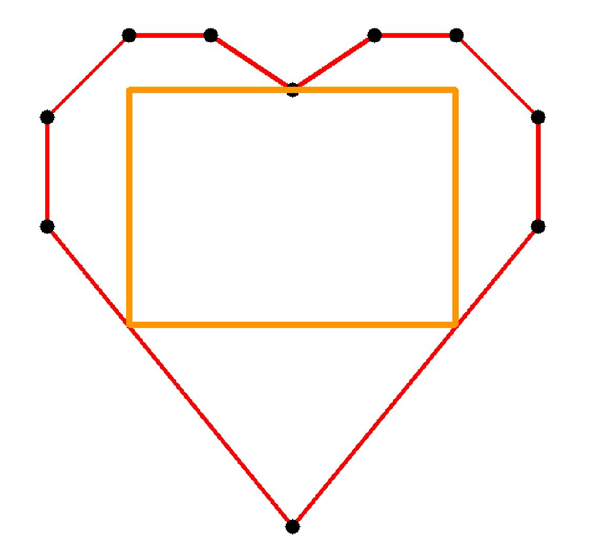
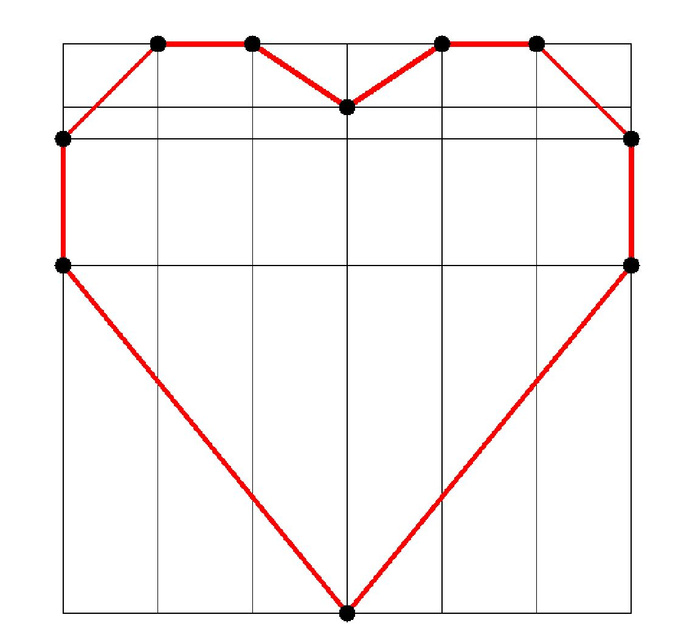
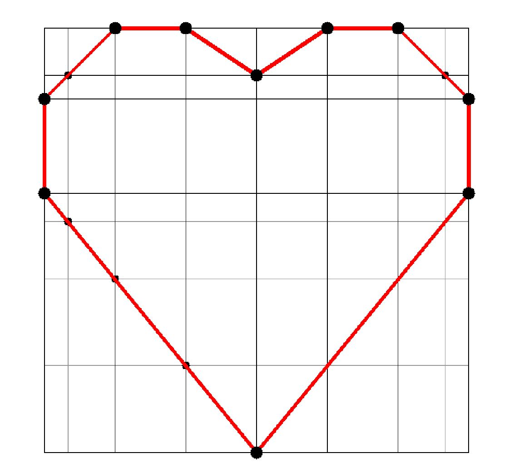
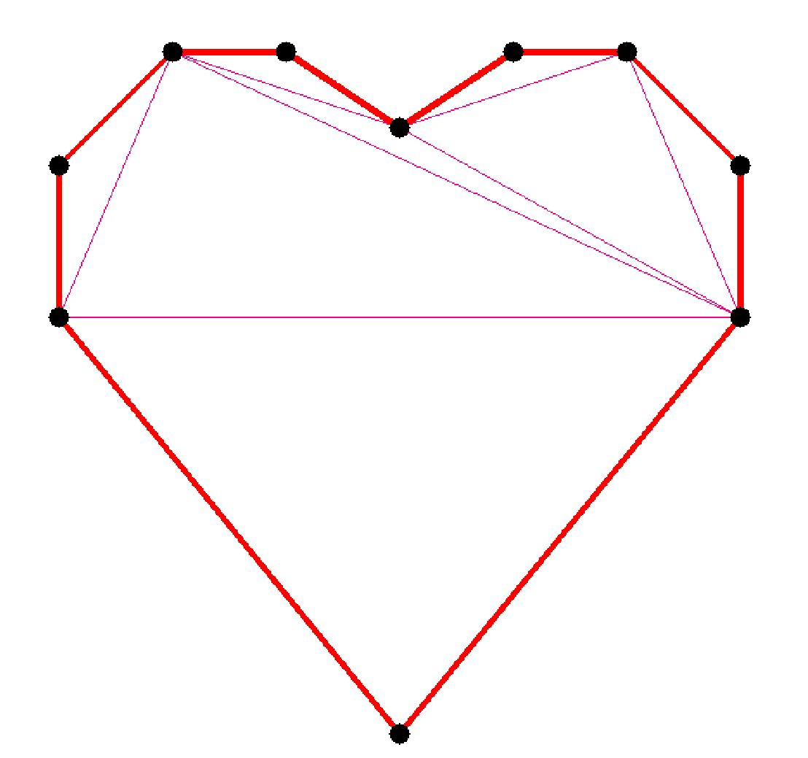
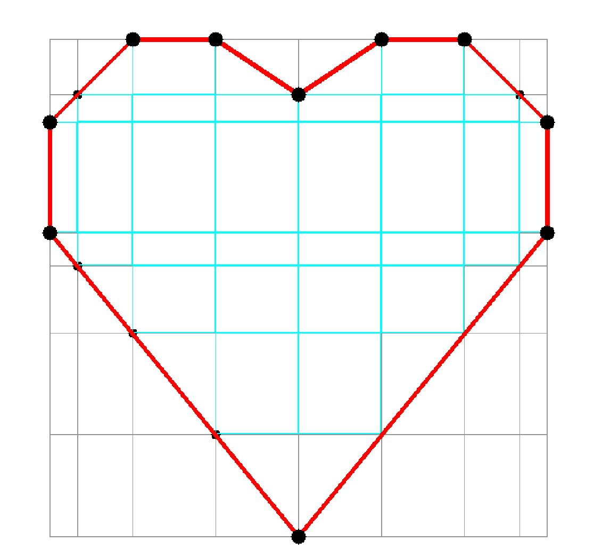
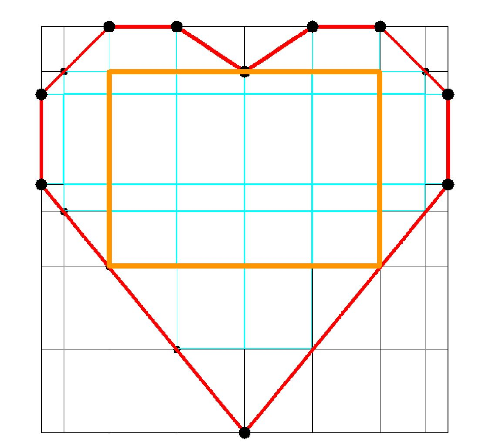

# Find max area inscribed aligned rectangle in polygon
> Warning: Inaccurate algorithm, may depend on the location of the points



## Algorithmic complexity 
Minimum: O(N^3)
Worse: O(N^6)

## Algorithm:

### Step 1
Из всех точек полигона создаём ненакладывающиеся лучи по осям X и Y:



### Step 2
Ищем точки пересечений лучей и сторон полигона, 
создаём из этих точек аналогичные лучи по X и Y,
и повторяем, пока будут ненакладывающиеся.



### Step 3
Теперь нужно найти прямоугольники, которые лежат внутри полигона целиком.
Для этого создадим триангуляцию полигона.
Проверим каждый прямоугольник - его вершины должны принадлежать какому-либо треугольнику.



### Step 4
Находим максимальную прямоугольную сумму площадей вложенных прямоугольников



### Result



## Problems
- Depends on the position of the points, it may not find the largest area.

## Limitations
- Polygon must not self-intersected and have holes

## Depends
- https://github.com/mapbox/earcut
- For run example: Qt and OpenCV 


## How to use
```c++
#include "inscribedmaxarearect.h"
...

std::vector<Geometry::Point> polygonForFind = { {(int) X, (int) Y}, ... };
InscribedMaxAreaRect IMAR(polygonForFind);

if ( IMAR.findMaxAreaInscribedRect() ) {
    Geometry::Rect maxAreaInscribedRect = IMAR.inscribedMaxAreaRect();
    ...
}
...
```

## License
MIT